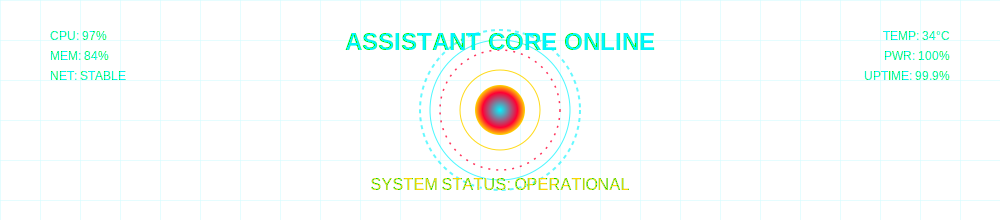

<!-- HUD BANNER -->

  

<!-- TYPING CONSOLE -->

<!-- DYNAMIC STATS -->

### 🛰️ **REAL-TIME SYSTEMS MONITOR**

<!-- STATS:START -->
> **CORE STATUS**: ONLINE  
> **ENERGY LEVEL**: 97%  
> **LAST UPDATE**: $(date)  
> **MISSION READY**: TRUE
<!-- STATS:END -->

<!-- QUICK LINKS -->

### 🌌 **NAVIGATION GRID**

<!-- FOOTER -->

  
*"The stars don't look bigger, but they do look brighter." — Sally Ride*

